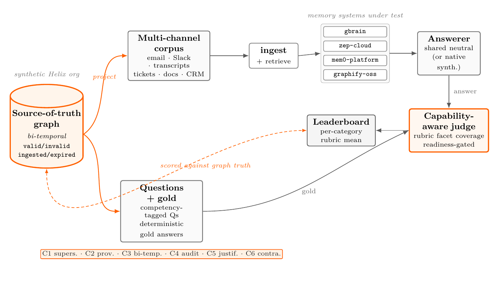
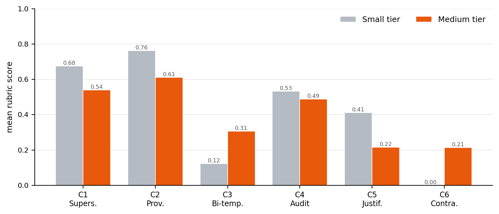

<div align="center">

# OrgMemBench

**A benchmark for long-horizon _organizational_ memory in AI agents.**

[](LICENSE)&nbsp;
[](datasets/LICENSE)&nbsp;
[](pyproject.toml)&nbsp;
[](paper/OrgMemBench.pdf)



**[Paper](paper/OrgMemBench.pdf)**&nbsp; · &nbsp;**[Data](datasets/helix)**&nbsp; · &nbsp;**[Reproduce](docs/REPRODUCIBILITY.md)**&nbsp; · &nbsp;**[Leaderboard](#leaderboard)**&nbsp; · &nbsp;**[Add your system](#evaluate-your-own-system)**

</div>

---

Can an AI agent answer what an organization decided, by whom, when, and why, across
many channels, many authors, and years of accumulated history? **OrgMemBench** measures
exactly that. It is a synthetic, multi-author, multi-channel, **bi-temporal** corpus
whose ground truth is projected deterministically from a known source-of-truth graph,
not read back out of free text.

Evaluating four publicly available memory systems under one uniform harness, we find
organizational-scale memory **far from solved**: the strongest system reaches only
**~0.43** (mean rubric score on the medium tier; ~0.39 on small), the field clusters
between **0.14 and 0.43**, and every system collapses on the temporal, contradiction,
and justification-chain reasoning that defines organizational memory.

## Leaderboard

Mean rubric-weighted score by tier (higher is better, range `[0,1]`), over the four
publicly available memory systems, each run end-to-end under one fixed harness with an
identical judge. Ordered by medium-tier mean; **best per column in bold**.

| System | Small mean | Medium mean |
|:--|--:|--:|
| **gbrain** | **0.394** | **0.428** |
| mem0-platform | 0.221 | 0.303 |
| zep-cloud | 0.252 | 0.213 |
| graphify-oss | 0.206 | 0.142 |

`gbrain` uses its native synthesizer; the retrieval-only systems share one fixed neutral
answerer (Claude Sonnet 4.6), so differences reflect the memory layer, not the generator.
Even the strongest system leaves roughly six-tenths of the achievable credit on the table.
The breakdown shows where: provenance and supersession hold up, but bi-temporal,
justification-chain, and contradiction reasoning sit near the floor.

<div align="center">

<br><sub><b>Where even the front-runner fails.</b> <code>gbrain</code> mean rubric score by category, small vs. medium tier. Full per-system, per-category results are in the <a href="paper/OrgMemBench.pdf">paper</a>.</sub>
</div>

> Single-seed results over small question sets (11 small, 73 medium); we attach no
> confidence intervals and read sub-0.1 between-system gaps as indicative, not significant.

## Why it's hard

AI agents are increasingly deployed as operational participants inside companies. In that
setting the binding failure is no longer "the agent doesn't know" — it is "the agent
confidently acts on a fact that is no longer true."

Existing memory benchmarks don't exercise this regime. LoCoMo and LongMemEval model a
_single narrator's_ history and are near-saturated; BEAM pushes volume to millions of
tokens but still varies _how much one narrator said_, not _who decided what across an
organization_. Organizational memory is structurally different along three axes:

- **Graph-shaped** — a decision is only actionable alongside the conversation that
  prompted it, the estimate that bounded it, and the sign-off that ratified it.
- **Bi-temporal** — companies revise decisions, so memory must separate what was true
  _then_ (valid time) from when it was recorded (ingestion time), preserving supersession
  instead of overwriting it.
- **Decision-traced** — the _why_ behind a fact is often worth more than the fact, and is
  how organizations avoid re-litigating settled questions.

## The benchmark

The seed organization is **Helix Logistics**, a small-to-mid SaaS/freight-tech company
with a coherent 2020–2026 arc. The substrate is a bi-temporal source-of-truth graph in
which every fact carries four timestamps (`valid_at`, `invalid_at`, `ingested_at`,
`expired_at`); facts are **invalidated, never deleted**, supersession links carry an
explicit reason, and `as_of` date-travel reconstructs any past belief state. The data is
synthetic by design — a freshly generated company can't appear in any system's
pretraining, so a high score can't be explained by memorization.

Answers are scored by **rubric-weighted facet coverage** in `[0,1]` (partial credit per
sub-criterion), not exact match. Each tier spans six categories:

| Code | Category | What it tests |
|:--|:--|:--|
| C1 | Supersession | The current value of a fact plus what it replaced, when, and why. |
| C2 | Decision provenance | Who decided, when, which alternatives were weighed, and the deciding rationale. |
| C3 | Bi-temporal (as-of) | What the organization believed as of a past date, distinct from now. |
| C4 | Audit replay | Reconstruct the knowledge state at a past date and flag what has since changed. |
| C5 | Justification chain | The evidence supporting a conclusion, each item classed as direct testimony vs. inference. |
| C6 | Contradiction | Detect that two artifacts conflict; report both sides and whether it was resolved. |

This release ships two tiers (larger tiers are planned):

| Tier | Artifacts | Tokens | Questions |
|:--|--:|--:|--:|
| Small | 121 | ~60K | 11 |
| Medium | 443 | ~200K | 73 |

### What a question looks like

> **C2 · Decision provenance** — _"Who led the decision to pivot Helix's architecture,
> when did they decide, what other options did they consider, and what was the main
> reason for the choice?"_

A correct answer must recover a **structured gold record** — here `decision`, `deciders`,
`decision_date`, `alternatives`, and `deciding_factor` — each scored as an independent
rubric facet with partial credit. One sub-criterion, for instance, requires naming **all
three** deciders (Maya Patel, Luis Hernandez, Arjun Mehta); paraphrase is accepted,
omission is penalized deterministically. The answer is licensed by three corpus artifacts
spanning the meeting where it was decided and the threads that confirmed it — so it can
only be answered by stitching evidence across channels, not by recalling one document.

## Quickstart

The harness runs in a container; each memory system under test runs as its own service.

```bash
# Build the harness image
docker build -t orgmembench .

# Corpus + question stats for a tier (free — no token spend)
docker run --rm orgmembench stats --tier small

# List the available system adapters
docker run --rm orgmembench list
```

**Self-hosted systems** need their backing infrastructure — bring up only what you run:

```bash
docker compose up -d qdrant      # mem0 vector store
docker compose up -d neo4j       # zep / graphiti temporal graph
docker compose up -d gbrain-pg   # gbrain Postgres backend
```

**Hosted systems** (`mem0-platform`, `zep-cloud`) need only an API key in your
environment (see [`env.example`](env.example); never commit keys). Runs are dry-run by
default; pass `--execute` with the keys/services in place to run for real:

```bash
docker run --rm --env-file .env orgmembench run --system gbrain --tier small --execute
docker run --rm --env-file .env orgmembench leaderboard   # render results/ -> leaderboard.md
```

Per-system stand-up notes live in [`docker/`](docker/); full reproduction detail is in
[`docs/REPRODUCIBILITY.md`](docs/REPRODUCIBILITY.md).

## Evaluate your own system

OrgMemBench is built to be extended, and the leaderboard is open.

1. **Write an adapter** — one small file in `orgmembench/adapters/` (ingest, retrieve, and
   an optional native answerer). Guide: [`docs/CONTRIBUTING-AN-ADAPTER.md`](docs/CONTRIBUTING-AN-ADAPTER.md).
2. **Run it** — `orgmembench run --system <name> --tier medium --execute`.
3. **Or score externally** — already have predictions? Score them directly:
   `orgmembench judge-submission --file preds.jsonl --system <name> --tier medium`.

Open a PR with your adapter and results, and we'll add your system to the leaderboard.

## Repository layout

```
OrgMemBench/
├── orgmembench/       evaluation harness: loaders, answerer, judge, runner,
│                      metrics, leaderboard, CLI + adapters/ (one per system)
├── datasets/helix/    the corpus: small/ and medium/ tiers (CC BY 4.0)
├── generation/        the open corpus-generation pipeline (helix_corpus)
├── config/            pinned, vendor-recommended config per system
├── docker/            per-system stand-up notes + docker-compose.yml
├── docs/              REPRODUCIBILITY.md, METHODOLOGY.md, adapter guide
├── paper/             the paper: LaTeX source + OrgMemBench.pdf
├── results/           where run output lands (empty until you run)
└── tests/             free smoke tests (no token spend)
```

## License

- **Code** (harness, adapters, generation): **MIT** — [`LICENSE`](LICENSE).
- **Dataset** (everything under `datasets/`): **CC BY 4.0** — [`datasets/LICENSE`](datasets/LICENSE). Attribution required; commercial use permitted.

## Citation

```bibtex
@misc{gardner2026orgmembench,
  title        = {OrgMemBench: A Benchmark for Long-Horizon Organizational Memory in AI Agents},
  author       = {Gardner, Jack},
  year         = {2026},
  note         = {Preprint},
  howpublished = {\url{https://github.com/JackCGardner/OrgMemBench}}
}
```
